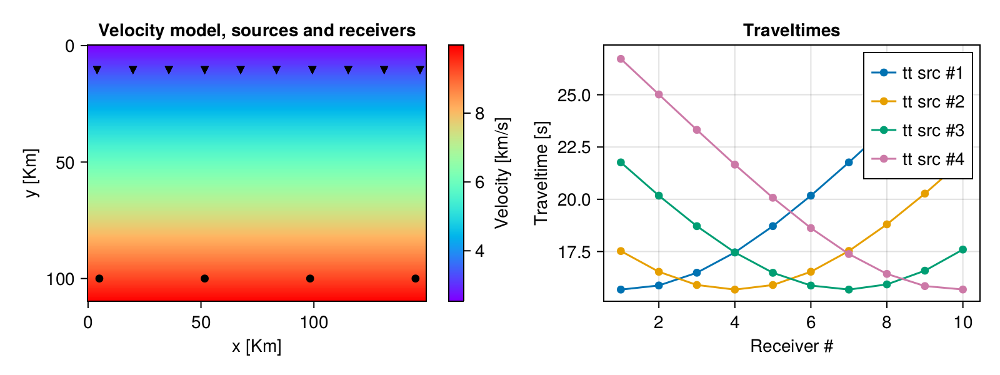
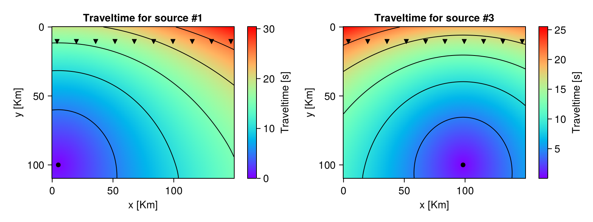

# EikonalSolvers.jl

[](https://juliageoph.gitlab.io/EikonalSolvers.jl/stable)
[](https://juliageoph.gitlab.io/EikonalSolvers.jl/dev)

A library to perform __seismic traveltime__ computations by solving the eikonal equation in two (__2D__) and three dimensions (__3D__) with the possibility of computing the __gradient of a misfit function__ with respect to the velocity model. The coordinate system can be either regular Cartesian or spherical.
The forward algorithm is based on a fast marching (FMM) method (2nd order) with a refinement of the grid around the source location. The computation of the gradient relies on the __discrete adjoint__ method.

For historical reasons, alternative solvers are available (poorly maintained), including a first order FMM method and the fast sweeping (FS) method for global updates with different kinds of local stencils. Additionally, a continuos adjoint method to calculate the gradient is also provided.

Both forward and gradient (adjoint) computations can be run in paralle using either Julia's distributed computing functions for distributed memory or threads for multicore processor. The  parallelisation scheme is "by source", distributing calculations for different seismic sources to different processors.


## Example of forward calculations in 2D

Here below an example of how to calculate traveltimes at receiver stations in 2D, given a grid geometry and positions of sources and receivers.
```julia
# load the package
using EikonalSolvers

# create the Grid2DCart struct
grd = Grid2DCart(hgrid=0.5,xinit=0.0,yinit=0.0,nx=300,ny=220)  # create the Grid2D struct
nsrc = 4 # number of sources
nrec = 10 # number of receivers
# coordinates of the sources (4 sources)
coordsrc = [grd.hgrid.*LinRange(10,290,nsrc)  grd.hgrid.*200.0.*ones(nsrc)] # coordinates of the sources (4 sources)
# coordinates of the receivers (10 receivers)
coordrec = [ [grd.hgrid.*LinRange(8,294,nrec) grd.hgrid.*20.0.*ones(nrec)] for i=1:nsrc] # coordinates of the receivers (10 receivers)
# velocity model
velmod = 2.5 .* ones(grd.nx,grd.ny)   # velocity model
# increasing velocity with depth...
for i=1:grd.ny 
  velmod[:,i] = 0.034 * i .+ velmod[:,i] 
end

# run the traveltime computation
ttimepicks = eiktraveltime(velmod,grd,coordsrc,coordrec)
```



Optionally it is possible to retrieve also the traveltime at all grid points.
```julia
ttimepicks,ttimegrid = eiktraveltime(velmod,grd,coordsrc,coordrec,returntt=true)
```



## Example of gradient calculations in 2D

The gradient of the misfit functional (see documentation) with respect to velocity can be calculated as following. A set of observed traveltimes, error on the measurements and a reference velocity model are also required, see the documentation for a detailed example.
```julia
# calculate the gradient of the misfit function w.r.t. velocity
gradvel = eikgradient(vel0,grd,coordsrc,coordrec,dobs,stdobs,:gradvel)
```

The gradient of the misfit function w.r.t. the source position can also be computed, e.g., as
```julia
# calculate the gradient of the misfit function w.r.t. velocity
gradsrcloc = eikgradient(vel0,grd,coordsrc,coordrec,dobs,stdobs,:gradsrcloc)

# now print the partial derivatives
@show(gradsrcloc)

4×2 Matrix{Float64}:
  0.139602    0.000915479
 -0.28355     0.408047
 -0.152851    0.072085
 -0.0200304  -0.249815
 ```

# Calculations in 3D 

Calculations in 3D for both Cartesian and spherical coordinates are analogous to the 2D function, see the documentation.


