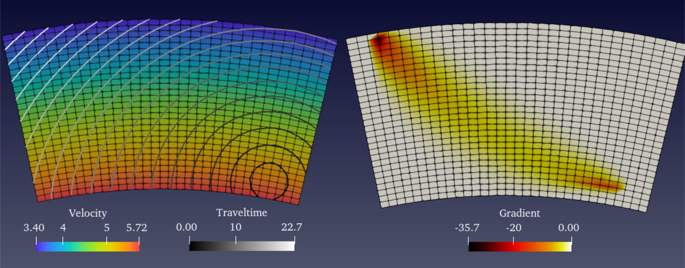

```@meta
EditURL = "https://gitlab.com/JuliaGeoph/EikonalSolvers.jl/-/tree/main/docs/src/"
```
# Contents

```@contents
Pages = ["index.md","publicapi.md","privatestuff.md"]
Depth = 2
```

# EikonalSolvers's documentation

A library to perform seismic traveltime computations by solving the eikonal equation in two (2D) and three dimensions (3D) with the possibility of computing the gradient of a misfit function with respect to the velocity model and the source location. The coordinate system can be either regular Cartesian or spherical. The forward algorithm is based on a fast marching (FMM) method (2nd order) with a refinement of the grid around the source location. The computation of the gradient relies on the discrete adjoint method.

For historical reasons, alternative solvers are available (poorly maintained), including a first order FMM method and the fast sweeping (FS) method for global updates with different kinds of local stencils. Additionally, a continuos adjoint method to calculate the gradient is also provided.

Both forward and gradient (adjoint) computations can be run in paralle using either Julia's distributed computing functions for distributed memory or threads for multicore processor. The parallelisation scheme is "by source", distributing calculations for different seismic sources to different processors.

This code is part of a larger project `HMCLab` ([^ZuninoGebraadetal2023]) targeting probabilistic geophysical inverse problems. Please cite the following papers if you use this code:

* Andrea Zunino, Scott Keating, Andreas Fichtner, **Eikonal tomography using the discrete adjoint state method**, in preparation.

* Andrea Zunino, Lars Gebraad, Alessandro Ghirotto, Andreas Fichtner, **HMCLab: a framework for solving diverse geophysical inverse problems using the Hamiltonian Monte Carlo method**, Geophysical Journal International, Volume 235, Issue 3, December 2023, Pages 2979–2991  [https://doi.org/10.1093/gji/ggad403](https://doi.org/10.1093/gji/ggad403)


## Installation

To install the package simple enter into the package manager mode in Julia by typing "`]`" at the REPL prompt and then use `add`, i.e.,
```
(v1.8) pkg> add EikonalSolvers
```
The package will be automatically downloaded from the web and installed.

Alternatively, use the path where the directory of the package is located, be it remote (GitLab)
```
(v1.8) pkg> add https://gitlab.com/JuliaGeoph/EikonalSolvers.jl
```
or local
```
(v1.8) pkg> add /path/to/EikonalSolvers.jl
```


## Theoretical background

The eikonal equation in 3D is given by:
```math
| \nabla \tau |^2 = \left( \dfrac{\partial \tau}{\partial x} \right)^2 +
\left( \dfrac{\partial \tau}{\partial y} \right)^2  +
\left( \dfrac{\partial \tau}{\partial z} \right)^2 =
\dfrac{1}{v^2(x,y,z)}
```
where ``\tau`` is the travel time, ``x,y,z`` the spatial coordinates and ``v`` the velocity.

In the numerical solution to the eikonal equation, there are two major components, the global scheme, which defines the strategy to update to the traveltime on the grid, i.e., the fast marching method and the local scheme, providing the finite difference stencils.

The gradient computations are based on the adjoint state method (see below).

## Numerical implementation

The solver for the eikonal equation ([^ZuninoGebraadetal2023]) is a second-order fast marching method (FMM) ([^Sethian1996], [^SethianPopovici1999]) using traditional stencils (e.g., [^RawlinsonSambridge2004]), with an additional refinement of the grid around the source.

Regarding the gradient of the misfit function with respect to velocity, the misfit function (without considering the prior) is defined as
```math
S = \dfrac{1}{2} \sum_i \dfrac{\left( \mathbf{\tau}_i^{\rm{calc}}(\mathbf{v})-\mathbf{\tau}_i^{\rm{obs}} \right)^2}{\sigma_i^2} \, .
```
The gradient of the above functional with respect to the velocity model ``\dfrac{d S}{d \mathbf{v}}`` can be calculated efficiently using the _adjoint_ state method (e.g., [^LeungQian2006], [^TreisterHaber2016]]). 

In this package we employ the __discrete adjoint state method__ to compute both gradients with respect to velocity and source location [^Zuninoetal2024], which takes into account the non-linearity of the forward problem - i.e., _no_ linearisation of the forward model and _no_ rays are employed. The computational cost is almost independent of the number of receivers and, because of the discretization, the result is a "diffuse" sensitivity around the theoretical rays (see an example in the following). 


## Exported functions / API

The following sets of functions are exported by `EikonalSolvers`. Units are arbitrary but must be *consistent*.

The geometry and size of the grid is defined via structures for Cartesian coordinates (rectilinear grids) or spherical/polar coordinates (curvilinear grids):
* [`Grid2DCart`](@ref), a `struct` describing the geometry and size of a 2D Cartesian grid;
* [`Grid3DCart`](@ref), a `struct` describing the geometry and size of a 3D  Cartesian grid;
* [`Grid2DSphere`](@ref), a `struct` describing the geometry and size of a 2D spherical grid;
* [`Grid3DSphere`](@ref), a `struct` describing the geometry and size of a 3D spherical grid;

The traveltime computations are performed using the following functions:
* [`eiktraveltime`](@ref), which computes the traveltimes in a 2D or 3D model; 

The gradient computations (using a 2D or 3D grid), instead, by
* [`eikgradient`](@ref), which computes the gradient of the misfit function with respect to velocity and/or source location.

Finally, the misfit functional calculation:
* [`eikttimemisfit`](@ref), computes the value (scalar) of the misfit functional for given observed traveltimes and velocity model.

Moreover, a convenience module `HMCTraveltimes` (see [`EikonalSolvers.HMCtraveltimes`](@ref)) is provided to facilitate the use of `EikonalSolvers` within the framework of Hamiltonian Monte Carlo inversion (see e.g. [^ZuninoMosegaard2018]) by employing the package `HMCsampler`. 

[`ExtraParams`](@ref) also may play an important role in certain user cases.


Additional functions are provided to perform forward and inverse calculations using different methods than the defaults. These functions are there for historical reasons and are pooly maintained. Do not rely on them.
* [`eiktraveltime2Dalt`](@ref) and [`eiktraveltime3Dalt`](@ref) which compute traveltimes using either a fast marching method ([^Sethian1996], [^SethianPopovici1999]) using Podvin-Lecomte stencils ([^PodvinLecomte1991]) or a fast sweeping method (FSM) ([^LeungQian2006]) using Podvin-Lecomte stencils ([^PodvinLecomte1991]) ;
* [`eikgradient2Dalt`](@ref) and [`eikgradient3Dalt`](@ref), which computes the 3D gradient of the misfit function with respect to velocity using either FMM or FSM ([^LeungQian2006],[^Taillandieretal2009]) and different stencils depending on user choices.


## Parallelisation

Both forward and gradient computations are parallelised using Julia's distributed computating functions. The parallelisation is "by source", meaning that traveltimes (or gradients) for different sources are computed in parallel. Therefore if there are ``N`` input sources and ``P`` processors, each processor will perform computations for about ``N \over P`` sources. The number of processors corresponds to the number of "threads" or "workers" (`Threads.nthreads()` or `nworkers()`) available to Julia when the computations are run. To enable parallel calculations the field `parallelkind` in the [`ExtraParams`](@ref) `struct` must be set either to `:sharedmem` or `:distribmem"` and passed to the forward or inverse routines. Default is `:serial`.

To get more than one thread for shared memory computing, Julia can either be started with `julia -t <N>` where `N` is the desired number of threads. To get more than one processor for distributed computing, instead, Julia can either be started with `julia -p <N>` where `N` is the desired number of processors or using `addprocs(<N>)` _before_ loading the module. 


## Example of forward calculations

### Cartesian coordinates

As an illustration in the following it is shown how to calculate traveltimes at receivers in 2D in Cartesian coordinates. 
Let's start with a complete example:

```@example full
using EikonalSolvers
grd = Grid2DCart(hgrid=0.5,xinit=0.0,yinit=0.0,nx=300,ny=220)  # create the Grid2D struct
nsrc = 4
nrec = 10
coordsrc = [grd.hgrid.*LinRange(10,290,nsrc)  grd.hgrid.*200.0.*ones(nsrc)] # coordinates of the sources (4 sources)
coordrec = [ [grd.hgrid.*LinRange(8,294,nrec) grd.hgrid.*20.0.*ones(nrec)] for i=1:nsrc] # coordinates of the receivers (10 receivers)
velmod = 2.5 .* ones(grd.nx,grd.ny)   # velocity model

# run the traveltime computation with default algorithm ("ttFMM_hiord")
ttimepicks = eiktraveltime(velmod,grd,coordsrc,coordrec)
nothing # hide
```
The output will be a vector of vectors with 4 elements (number of sources) each of which being a 10-element array (number of receivers):
```@example full
ttimepicks
```
Now let's analyse more in details the various components. 
First of we have to import the module and define the parameters of the grid using the struct `Grid2D`:
```@example parts
using EikonalSolvers
# hgrid: grid spacing
# xinit,yinit: grid origin coordinates
# nx,ny: grid size
grd = Grid2DCart(hgrid=0.5,xinit=0.0,yinit=0.0,nx=300,ny=220)  # create the Grid2D struct
```
Then define the coordinates of the sources, a two-column array (since we are in 2D) representing the \$x\$ and \$y\$ coordinates
```@example parts
nsrc = 4
coordsrc = [grd.hgrid.*LinRange(10,290,4)   grd.hgrid.*200.0.*ones(4)] 
```
and the receivers, a "vector of arrays", i.e., a vector where each element (one element per each source) is a two-column array (since we are in 2D) representing the \$x\$ and \$y\$ coordinates
```@example parts
nrec = 10
coordrec = [ [grd.hgrid.*LinRange(8,294,nrec) grd.hgrid.*20.0.*ones(nrec)] for i=1:nsrc] # coordinates of the receivers (10 receivers)
```
The velocity model is defined as a 2D array with size (`grd.nx` \$\times\$ `grd.ny`)
```@example parts
velmod = 2.5 .* ones(grd.nx,grd.ny) 
# increasing velocity with depth...
for i=1:grd.ny 
  velmod[:,i] = 0.034 * i .+ velmod[:,i] 
end
```
Finally, the traveltime at receivers is computed
```@example parts
ttimepicks = eiktraveltime(velmod,grd,coordsrc,coordrec)
nothing # hide
```
Now the traveltimes can be plotted, e.g., using Makie
```@example parts
using CairoMakie

fig = Figure(size=(800,300))

ax1 = Axis(fig[1,1][1,1],title="Velocity model, sources and receivers",xlabel="x [Km]",ylabel="y [Km]")
hm = heatmap!(ax1,grd.x,grd.y,velmod,colormap=:rainbow1) 
Colorbar(fig[1,1][1,2],hm,label="Velocity [km/s]")
for cr in coordrec
	scatter!(ax1,cr[:,1],cr[:,2],marker=:dtriangle,color=:black)
end
scatter!(ax1,coordsrc[:,1],coordsrc[:,2],marker=:circle,color=:black)
ax1.yreversed=true

ax2 = Axis(fig[1,2],title="Traveltimes",xlabel="Receiver #",ylabel="Traveltime [s]")
for (i,tt) in enumerate(ttimepicks)
	scatterlines!(ax2,1:length(tt),tt[:],label="tt src #$i")
end
axislegend(ax2)

save("images/velmod-ttpicks.png",fig) # hide
nothing # hide
```

```@example parts
@show ttimepicks
```

To additionally return the traveltime everywhere on the grid do
```@example parts
ttimepicks,ttimegrid = eiktraveltime(velmod,grd,coordsrc,coordrec,returntt=true)
@show size(ttimegrid)
nothing # hide
```
The traveltime across all grid can then be visualized
```@example parts
using CairoMakie

fig = Figure(size=(800,300))

s = 1
ax1 = Axis(fig[1,1][1,1],title="Traveltime for source #$s",xlabel="x [Km]",ylabel="y [Km]")
hm = heatmap!(ax1,grd.x,grd.y,ttimegrid[s],colormap=:rainbow1) 
Colorbar(fig[1,1][1,2],hm,label="Traveltime [s]")
contour!(ax1,grd.x,grd.y,ttimegrid[s],color=:black)
for cr in coordrec
	scatter!(ax1,cr[:,1],cr[:,2],marker=:dtriangle,color=:black)
end
scatter!(ax1,coordsrc[s,1],coordsrc[s,2],marker=:circle,color=:black)
ax1.yreversed=true

s = 3
ax2 = Axis(fig[1,2][1,1],title="Traveltime for source #$s",xlabel="x [Km]",ylabel="y [Km]")
hm = heatmap!(ax2,grd.x,grd.y,ttimegrid[s],colormap=:rainbow1) 
Colorbar(fig[1,2][1,2],hm,label="Traveltime [s]")
contour!(ax2,grd.x,grd.y,ttimegrid[s],color=:black)
for cr in coordrec
	scatter!(ax2,cr[:,1],cr[:,2],marker=:dtriangle,color=:black)
end
scatter!(ax2,coordsrc[s,1],coordsrc[s,2],marker=:circle,color=:black)
ax2.yreversed=true

save("images/ttime-arrays.png",fig) # hide
nothing # hide
```

The resulting traveltime array on the grid is returned as a three-dimensional array, containing a set of two-dimensional arrays, one for each source.
```@example parts
@show size(ttimegrid)
```	

<!-- ### Spherical coordinates -->

<!-- Here we show an example of traveltime calculation in spherical coordinates in 2D. The grid is defined in terms of the radius `r` and the angle `θ`, representing the *co*-latitude. In 3D there is the additional angle `φ`, representing the longitude. -->
<!-- Remark: for spherical coordinates some Greek symbols are used. You can render them in Julia as following: -->

<!-- Symbol | How to render -->
<!-- --- | ---  -->
<!-- Δ | \Delta^TAB  -->
<!-- θ | \theta^TAB -->
<!-- φ | \varphi^TAB -->

<!-- The function for traveltimes in spherical coordinates, analogously to the Cartesian case, is `traveltime2Dsphere()`. -->
<!-- The grid setup and forward computations are carried out as shown in the following script.  -->
<!-- ```@example fullsph -->
<!-- using EikonalSolvers -->
<!-- grd = Grid2DSphere(Δr=2.0,Δθ=0.2,nr=40,nθ=70,rinit=500.0,θinit=10.0) # create the Grid2DSphere struct -->
<!-- coordsrc = [grd.rinit.+grd.Δr*3  grd.θinit.+grd.Δθ*(grd.nθ-5)] # coordinates of the sources (1 source) -->
<!-- coordrec = [[grd.rinit.+grd.Δr*(grd.nr-3) grd.θinit.+grd.Δθ*3] ] # coordinates of the receivers (1 receiver), vector of arrays -->
<!-- velmod = 2.5 .* ones(grd.nr,grd.nθ)                           # velocity model -->

<!-- # run the traveltime computation  -->
<!-- ttimepicks = traveltime2D(velmod,grd,coordsrc,coordrec) -->
<!-- nothing # hide -->
<!-- ``` -->
<!-- The following picture shows an example of computed traveltime and gradient in spherical coordinates in 2D. -->
<!--  -->


## Example of gradient w.r.t velocity calculation

### Cartesian coordinates

Here a synthetic example of 2D gradient computations in Cartesian coordinates is illustrated. In reality, traveltime data are "measured" from recorded seismograms, however, here we first create some synthetic "observed" traveltimes using a synthetic velocity model. First the grid and velocity model are set up, then forward calculations are performed, as in the section above [Example of forward calculations](@ref).
```@example grad1
using EikonalSolvers
hgrid=0.5
grd = Grid2DCart(hgrid=hgrid,xinit=0.0,yinit=0.0,nx=300,ny=220)         # create the Grid2D struct
nsrc = 4
nrec = 10
coordsrc = [0.95*hgrid.*LinRange(12,290,nsrc)   hgrid.*207.0.*ones(nsrc)] # coordinates of the sources (4 sources)
coordrec = [[hgrid.*LinRange(8.0,290.0,nrec)  hgrid.*20.0.*ones(nrec)] for i=1:nsrc] # coordinates of the receivers (10 receivers)
velmod = 2.5 .* ones(grd.nx,grd.ny)                                # velocity model
# increasing velocity with depth...
for i=1:grd.ny
  velmod[:,i] = 0.034 * i .+ velmod[:,i]
end

# run the traveltime computation with default algorithm ("ttFMM_hiord")
ttpicks = eiktraveltime(velmod,grd,coordsrc,coordrec)
nothing # hide
```
Then the "observed" traveltime data are created by adding some Gaussian noise to the traveltimes computed above to simulate real measurements.
```@example grad1
# standard deviation of error on observed data
stdobs = [0.15.*ones(size(ttpicks[1])) for i=1:nsrc]
# generate a "noise" array to simulate real data
noise = [stdobs[i].^2 .* randn(size(stdobs[i])) for i=1:nsrc]
# add the noise to the synthetic traveltime data
dobs = ttpicks .+ noise 
nothing # hide
```

Now we can finally compute the gradient of the misfit functional (see above) at a given point, i.e., the gradient is computed at a given velocity model: ``\dfrac{d S}{d \mathbf{v}} \Big|_{\mathbf{v}_0}``.
```@example grad1
# create a guess/"current" model
vel0 = 2.3 .* ones(grd.nx,grd.ny)
# increasing velocity with depth...
for i=1:grd.ny
   vel0[:,i] = 0.015 * i .+ vel0[:,i]
end
    
# calculate the gradient of the misfit function
gradvel = eikgradient(vel0,grd,coordsrc,coordrec,dobs,stdobs,:gradvel)
nothing # hide
```
Finally, plot the rsults 
```@example grad1
using CairoMakie

fig = Figure(size=(800,300))

ax1 = Axis(fig[1,1][1,1],title="Reference velocity model",xlabel="x [Km]",ylabel="y [Km]")
hm = heatmap!(ax1,grd.x,grd.y,vel0,colormap=:rainbow1) 
Colorbar(fig[1,1][1,2],hm,label="Velocity [km/s]")
for cr in coordrec
	scatter!(ax1,cr[:,1],cr[:,2],marker=:dtriangle,color=:black)
end
scatter!(ax1,coordsrc[:,1],coordsrc[:,2],marker=:circle,color=:black)
ax1.yreversed=true

ax2 = Axis(fig[1,2][1,1],title="Gradient w.r.t. velocity",xlabel="x [Km]",ylabel="y [Km]")
vmax = maximum(abs.(gradvel))
hm = heatmap!(ax2,grd.x,grd.y,gradvel,colormap=:seismic,colorrange=(-vmax,vmax)) 
Colorbar(fig[1,2][1,2],hm,label="Gradient")
for cr in coordrec
	scatter!(ax2,cr[:,1],cr[:,2],marker=:dtriangle,color=:black)
end
scatter!(ax2,coordsrc[:,1],coordsrc[:,2],marker=:circle,color=:black)
ax2.yreversed=true

save("images/grad-vel.png",fig) # hide
nothing # hide
```

The calculated gradient is an array with the same shape than the velocity model.
```@example grad1
@show size(gradvel)
``` 

<!-- ### Spherical coordinates -->

<!-- Here a synthetic example of 2D gradient computations in spherical coordinates is shown. -->
<!-- ```@example grad1sph -->
<!-- using EikonalSolvers -->
<!-- grd = Grid2DSphere(Δr=2.0,Δθ=0.2,nr=40,nθ=70,rinit=500.0,θinit=10.0) # create the Grid2DSphere struct -->
<!-- coordsrc = [grd.rinit.+grd.Δr*3  grd.θinit.+grd.Δθ*(grd.nθ-5)] # coordinates of the sources (1 source) -->
<!-- nsrc = size(coordsrc,1) -->
<!-- coordrec = [[grd.rinit.+grd.Δr*(grd.nr-3) grd.θinit.+grd.Δθ*3] for i=1:nsrc] # coordinates of the receivers (1 receiver) -->

<!-- # velocity model -->
<!-- velmod = 2.5 .* ones(grd.nr,grd.nθ)  -->
<!-- # run the traveltime computation -->
<!-- ttpicks = traveltime2D(velmod,grd,coordsrc,coordrec) -->

<!-- # standard deviation of error on observed data -->
<!-- stdobs = [0.15.*ones(size(ttpicks[1])) for i=1:nsrc] -->
<!-- # generate a "noise" array to simulate real data -->
<!-- noise = [stdobs[i].^2 .* randn(size(stdobs[i])) for i=1:nsrc] -->
<!-- # add the noise to the synthetic traveltime data -->
<!-- dobs = ttpicks .+ noise -->

<!-- # create a guess/"current" model  -->
<!-- vel0 = 3.0 .* ones(grd.nr,grd.nθ) -->

<!-- # calculate the gradient of the misfit function -->
<!-- grad = gradttime2D(vel0,grd,coordsrc,coordrec,dobs,stdobs) -->
<!-- nothing # hide -->
<!-- ```	 -->
<!-- An example of a (thresholded) sensitivity kernel and contouring of traveltimes in 3D, using spherical coordinates, is depicted in the following plot: -->
<!--  -->

## Example of gradient w.r.t source location calculation

Here a synthetic example of 2D gradient computation w.r.t. source location in Cartesian coordinates is illustrated. In reality, traveltime data are "measured" from recorded seismograms, however, here we first create some synthetic "observed" traveltimes using a given velocity model. First the grid and velocity model are set up, then forward calculations are performed, as in the section above [Example of forward calculations](@ref).
```@example gradsrcloc
using EikonalSolvers
hgrid=0.5
grd = Grid2DCart(hgrid=hgrid,xinit=0.0,yinit=0.0,nx=300,ny=220)         # create the Grid2D struct
nsrc = 4
nrec = 10
coordsrc = [0.95*hgrid.*LinRange(12,290,nsrc)   hgrid.*207.0.*ones(nsrc)] # coordinates of the sources (4 sources)
coordrec = [[hgrid.*LinRange(8.0,290.0,nrec)  hgrid.*20.0.*ones(nrec)] for i=1:nsrc] # coordinates of the receivers (10 receivers)
velmod = 2.5 .* ones(grd.nx,grd.ny)                                # velocity model
# increasing velocity with depth...
for i=1:grd.ny
  velmod[:,i] = 0.034 * i .+ velmod[:,i]
end

# run the traveltime computation with default algorithm ("ttFMM_hiord")
ttpicks = eiktraveltime(velmod,grd,coordsrc,coordrec)
nothing # hide
```
Then the "observed" traveltime data are created by adding some Gaussian noise to the traveltimes computed above to simulate real measurements.
```@example gradsrcloc
# standard deviation of error on observed data
stdobs = [0.15.*ones(size(ttpicks[1])) for i=1:nsrc]
# generate a "noise" array to simulate real data
noise = [stdobs[i].^2 .* randn(size(stdobs[i])) for i=1:nsrc]
# add the noise to the synthetic traveltime data
dobs = ttpicks .+ noise 
nothing # hide
```
Now the gradient w.r.t. source location, ``\dfrac{d S}{d \mathbf{x}^{\rm src}}``, can be computed as follows
```@example gradsrcloc
# calculate the gradient of the misfit function w.r.t. source location
#   notice the last argument :gradsrcloc
gradsrcloc = eikgradient(velmod,grd,coordsrc,coordrec,dobs,stdobs,:gradsrcloc)
nothing # hide
```
The gradient is returned as an array where each row contains the partial derivatives for each source:
```@example gradsrcloc
# now print the partial derivatives
@show(gradsrcloc)
```


# References

[^ZuninoGebraadetal2023]: Zunino A., Gebraad, L., Ghirotto, A. and Fichtner, A., (2023). HMCLab a framework for solving diverse geophysical inverse problems using the Hamiltonian Monte Carlo algorithm, Geophysical Journal International, Volume 235, Issue 3, December 2023, Pages 2979–2991, https://doi.org/10.1093/gji/ggad403.

[^Zuninoetal2024]: Andrea Zunino, Scott Keating, Andreas Fichtner, Eikonal tomography using the discrete adjoint state method, in preparation.
 
[^LeungQian2006]: Leung, S. and Qian, J. (2006). An adjoint state method for three-dimensional transmission traveltime tomography using first-arrivals. Communications in Mathematical Sciences, 4(1), 249-266.

[^TreisterHaber2016]: Treister, Eran & Haber, Eldad. (2016). A fast marching algorithm for the factored eikonal equation. Journal of Computational Physics. 324. 210–225. 10.1016/j.jcp.2016.08.012. 

[^PodvinLecomte1991]: Podvin, P. and Lecomte, I. (1991). Finite difference computation of traveltimes in very contrasted velocity models: a massively parallel approach and its associated tools. Geophysical Journal International, 105, 271-284.

[^RawlinsonSambridge2004]: Rawlinson, N. and Sambridge, M. (2004). Wave front evolution in strongly heterogeneous layered media using the fast marching method. Geophys. J. Int., 156(3), 631-647.

[^Sethian1996]: Sethian A. J. (1996). A fast marching level set method for monotonically advancing fronts. Proceedings of the National Academy of Sciences Feb 1996, 93 (4) 1591-1595. 

[^SethianPopovici1999]: Sethian A. J. and Popovici A. (1999). Three dimensional traveltimes computation using the Fast Marching Method. Geophysics. 64. 516-523. 

[^Taillandieretal2009]: Taillandier, C., Noble, M., Chauris, H. and Calandra, H. (2009). First arrival travel time tomography based on the adjoint state methods. Geophysics, 74(6), WCB57–WCB66.

[^ZuninoMosegaard2018]: Zunino A., Mosegaard K. (2018), Integrating Gradient Information with Probabilistic Traveltime Tomography Using the Hamiltonian Monte Carlo Algorithm, 80th EAGE Conference & Exhibition, Copenhagen.
